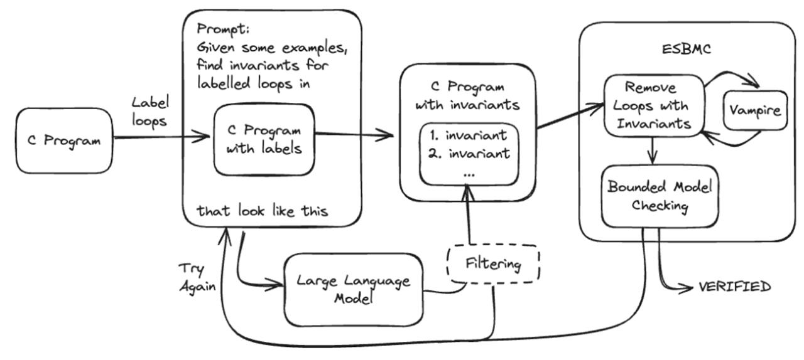

# The ESBMC ibmc (Invariant Based Model Checking) Tool
---------------------------------------------------------------------------------------------------------------------------------------------------------------------------------------------------------------------------------------------------------

This repository contains tools, scripts and benchmarks relating to the tool ESBMC ibmc - which is an extension of the tool ESBMC (Efficient SMT-Based Context Bounded Model Checker). 

This tool extension's contents and details are mentioned in the paper titled _LLM-Generated Invariants For Bounded Model Checking Without Loop Unrolling_.

This is the Overall Pipeline of the Tool: 



The folder structure is as follows:

```
root
├───Benchmarks
│   ├───ibmc_benchmarks
│   ├───ibmc_benchmarks_with_invariants
│   ├───ibmc_code2inv_parsable_benchmarks
│   ├───paper_benchmarks
│   ├───SeaHorn_Benchmarks
│   └───Multiple_Loops
├───Code_Pipelines
└───Images
```
  
We briefly mention what each folder contains:

## Benchmarks

A set of benchmarks that some of which we refer to in our paper, whilst others are not as research is currently happening on this, and test our tools on.

### ibmc_benchmarks

A set of 133 benchmarks originating from the [code2inv repository](https://github.com/PL-ML/code2inv/tree/master/benchmarks/C_instances/c). We have updated the benchmarks to use assertion syntax recognised by ESBMC and VeriAbs tools.

### ibmc_benchmarks_with_invariants

The same 133 benchmarks as above, but in this case all benchmarks that can successfully be verified by the ESBMC ibmc tool have their loops marked with the invariants that the tool generated and validated. The invariants are identified by a special function `__invariant(...)` that only our development branch of ESBMC (instruction on how to obtain provided below) can currently recognise.

### ibmc_code2inv_parsable_benchmarks

The same 133 benchmarks are used as mentioned above. We have updated the benchmarks to use in the Blackbox based pipelines. 

### paper_benchmarks

A number of benchmarks referred to in the paper that are not amongst the 133 benchmarks included in the other benchmark folders.

### SeaHorn_benchmarks

Again, the same 133 benchmarks mentioned above, but in this instance the assertions are per the SeaHorn verifier's syntax. 

### Multiple_Loops

A number of benchmarks that are not part of the paper, they contain multiple loops. 

## Code_Pipelines

This folder contains a set of Python scripts for invoking our LLM pipelines. As mentioned in the paper, we developed 6 pipelines which invoke ChatGPT in different ways to generate candidate invariants.

The names of the Python scripts directly link them with the pipelines discussed in the paper. The folder also contains a pair of Python scripts `Prompt_Examples.py` and `Prompt_Examples_2.py`. These are used by the pipeline scripts, but can be ignored by users of the repository. We discuss how to run the pipelines below.

Note: The Pipeline_7_Multiple_Loops.py pipeline uses a modified prompt and the temperature of 0.3 to generate successful results - further testing on all the code2inv benchmarks is underway. 

# Obtaining ESBMC and Vampire

The ESBMC ibmc tool requires to binaries to run. A binary of the ESBMC verifier and a binary of the first-order superposition prover Vampire.

## Obtaining ESBMC

ESBMC binaries for macOS Sonoma and Ubuntu 20.04 can be found [here](https://drive.google.com/drive/folders/1-2Efeg2xq_U2rFsyT77ynK5aTJSyuAYz?usp=drive_link). **We expect them to work with other versions of macOS and Linux, but have not tested them ourselves.**

## Obtaining Vampire

To obtain the exact version of Vampire we used in our benchmarking runs, we recommend building Vampire from source. This can be achieved as follows.

```
git clone https://github.com/vprover/vampire.git
```
```
cd vampire
```
```
git checkout 61ac5403f04de58b0b172b1bd889355dd326b9aa
```

Then follow the instructions at the [Vampire Github repo](https://github.com/vprover/vampire) to build. To obtain results similar to ours we recommend building with Z3.

As an alternative to building from source, you can [download Vampire 4.8](https://github.com/vprover/vampire/releases/tag/v4.8casc2023). We have not tested with Vampire 4.8, but expect it to work. Please note that the binary included in the Vampire releases will only run on Linux distros, not macOS.


# Running ESBMC with Vampire

After completing the instructions from the previous section, you should have working binaries for ESBMC and Vampire on your system.

 The command to run ESBMC with Vampire to verify a benchmark:

```
<path to ESBMC executable> <path to c benchmark file> --vampire-for-loops --ir --output <output file name> --vampire-path <path to Vampire executable> --no-bounds-check
```

Note that for verification to succeed the benchmark must contain suitable invariants. It thus makes sense to invoke the tool on one of the benchmarks in the ibmc_benchmarks_with_invariants folder.

# Running the pipelines

We have tested running the pipeline scripts with Python version 3.10.11. We expect them to work with similar versions of Python, but cannot guarantee it. The scripts require the Python  `openai` package at version 0.28. This can be installed by:

```
python3 -m pip install openai==0.28
```

Users are welcome to use a virtual environment.

Assuming that you are located in the root folder of this repo, the following commands can be used to execute any of the pipelines. Note that the pipelines invoke ChatGPT to obtain the candidate invariants and hence it is necessary to have a OpenAI API key to run the pipelines. To allow the scripts to make use of this key please set the environment variable `key_for_the_API` to hold your key. This can be done as follows:

```
export key_for_the_API="<your key>"
```

To run a pipeline do:

```
cd Code_Pipelines
```

```
python3 <pipeline name> <path to ESBMC executable> <path to Vampire executable>
```

This will start the named pipeline running on all the benchmarks contained in the ibmc_benchmarks folder. 
